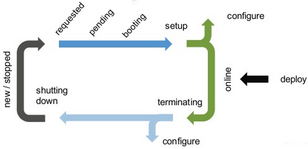
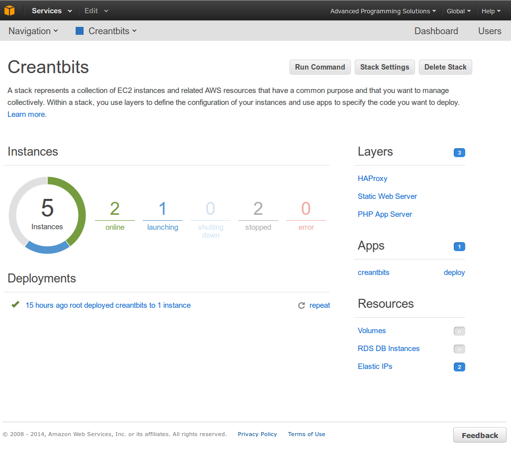
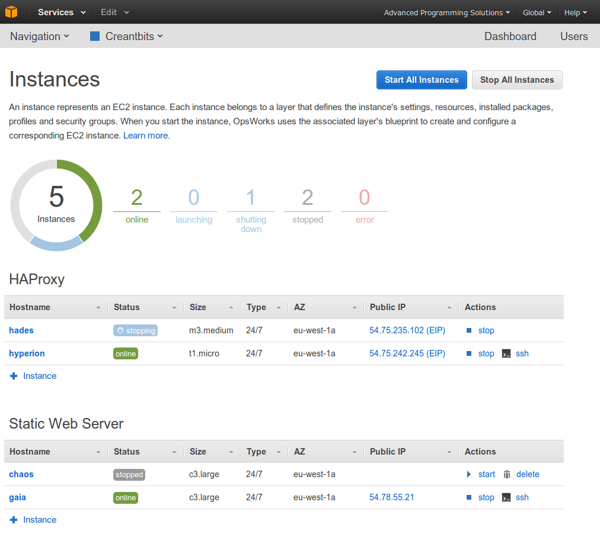
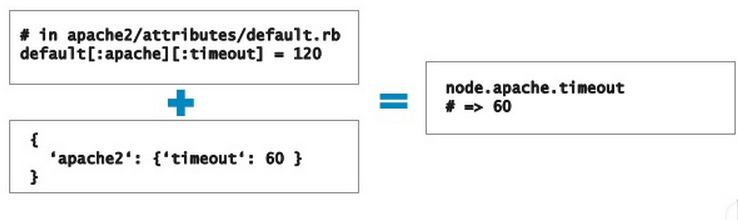
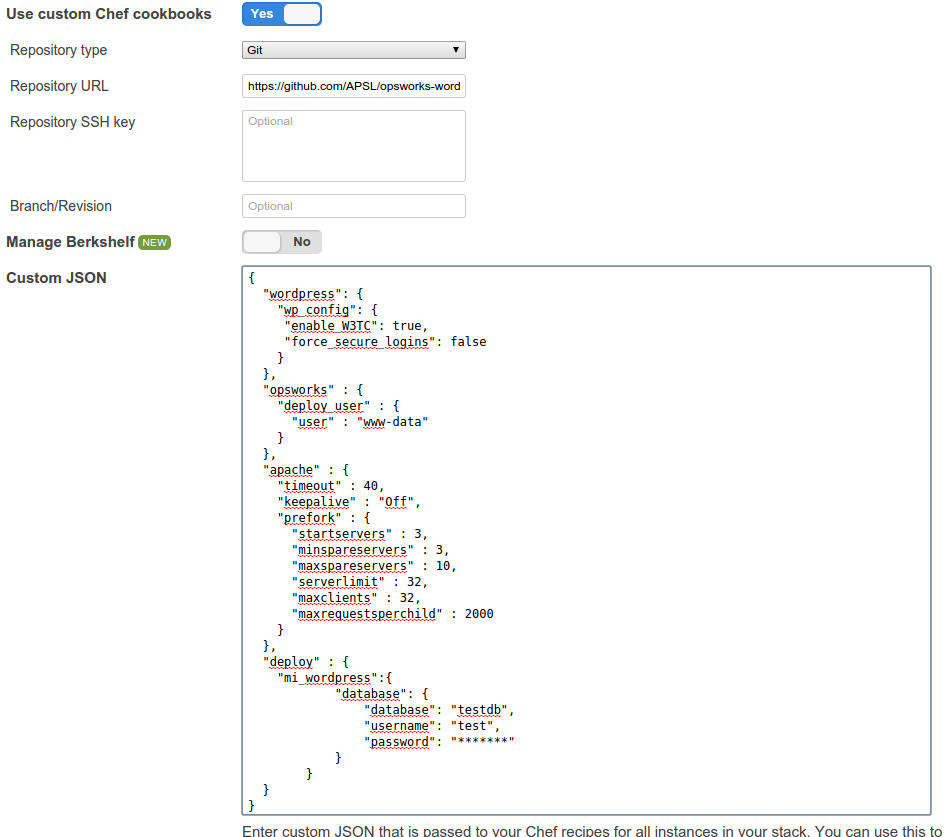

# Goldcar Amazon Opsworks

Creantbits, Octubre 2014

.notes: Pressing 2 will display these fascinating notes

.fx: titleslide

---

.fx: imageslide 

---

# AWS OpsWorks

* *DevOps Application Management Service*

---

# AWS OpsWorks

* *DevOps Application Management Service*
* Agrupación y orquestación de servicios AWS
* Orientado al ciclo de vida de la **Aplicación**
* Inicialmente, un *experimento* separado dentro de AWS

---

## ¿Porqué OpsWorks? - Simplicidad vs Control

* Heroku y OpenShift estarían cerca de OpsWorks

---

## Características OpsWorks

* Altamente customizable. Al final, todo acaba en una ejecución Chef.
* Arquitectura repetible. Orientada a fallos.
* Sólo pagas por recursos AWS usados.
* Arquitectura auto documentada: Modelado Layers, recetas mantenidas en Git.
* Distintos entornos idénticos y repetibles: prod, pre, test
* Mejor con arquitecturas "shared noting" (12factor.net)

---

## ¿Qué provee OpsWorks?

* Provisionamiento instancias. Integración AWS
* deploy + rollback. Automatización del ciclo de vida de una aplicación
* Gestión de la configuración
* Balanceo carga
* Escalado automático. Auto Healing
* Logs + Monitorización
* Consola web, aws-cli, API (python boto)
* Permisos

---

# Conceptos OpsWorks fundamentales

* Stack
* Layers
* Aplicaciones
* Instancias

* Lifecycle Events

Nomenclatura propia OpsWorks.

---

.fx: imageslide 

---
# Stack

Es el contenedor de más alto nivel, y abarca una o más aplicaciones y todos sus
recursos necesarios. Para una aplicación completa, crearemos un stack, pero
podremos usar varios stacks para entornos de producción, test o pre-produción.

---
# Layer

* Cada stack tiene uno o más layers. 
* Podemos definir cada layer como distintos roles de servicio. 
* Por ejemplo, podríamos tener un layer de balanceo de carga, uno de memcached, y otro de servidor de aplicaciones. 
* Podremos usar los layers que vienen de serie, o Custom Layers

.fx: align-right

---

# Built-in Layers

* Haproxy
* Rails App Server
* PHP
* Node.js
* Java
* Mysql
* Memcached
* Ganglia

---

# Aplicación

* Es el código de la aplicación. 
* La fuente puede ser S3, git o un zip. En nuestro caso, usamos repositorios git. 
* La aplicación se despliega en un layer. 
* Un layer puede contener distintas aplicaciones que se escalarán y configurarán conjuntamente.

---

# Instancias

* Las instancias se asignan a uno o más layers. 
* Por ejemplo, podemos asignar instancias al layer de haproxy.
* Podemos iniciar instancias **manualmente**, **por tiempo**, o **por carga** bajo demanda (memoria, carga o uso de cpu).

---

.fx: imageslide

---

.fx: imageslide

---

.fx: imageslide

---

# Arquitectura OpsWorks

* OpsWorks backend genera eventos: deploy app, escalado.
* Opsworks agent  escucha eventos del ciclo de vida
* El agente lanza *Chef Solo*, sobre datos json

---

* Versiones soportadas: 11.4 o 11.10
* Lanzado por los eventos del ciclo de vida
* Cada evento viene con un estado JSON
* https://github.com/opscode-cookbooks
* https://community.opscode.com/
* https://docs.getchef.com/

---

# Eventos del ciclo de vida

Las recetas se definen en cada **layer**, y se ejecutan por eventos generados por el ciclo 
de vida de la aplicación.

---

# Eventos del ciclo de vida

---

.fx: imageslide

---

.fx: imageslide

---

.fx: imageslide

---

# Opciones Customización

* Sobreescribir atributos en "Custom Json"
* Sobreescribir atributos chef vía receta custom
* Sobreescribir Plantilla Chef
* Deploy hooks
* Proveer receta customizada en Layer por defecto
* Proveer receta customizada en Layer Custom.

(Ordenados de más simples a más control)

---

# Atributos y Custom Json

---

.fx: imageslide

---

# Deploy hooks:

    !bash
    $ cd mi_app_code
    $ ls deploy/
        before_migrate.rb
        before_symlink.rb
        before_restart.rb
        after_restart.rb

    $ cat deploy/after_restart.rb

    Chef::Log.info("GC: Ejecutando before_symlink hook..")
    node[:deploy].each do |application, deploy|
        app_root = "#{deploy[:deploy_to]}/current"
        execute "chmod -R g+rw #{app_root}/cache" do
        end
    end

---

# Estructura receta Chef

Cookbook: "wordpress::configure"

    !bash
    $ find wordpress/

        recipes/configure.rb
        attributes/default.rb 
        templates/default/wp-config.php.erb

---

#  Estructura receta Chef

    !bash
    $ cat attributes/default.rb

    default['wordpress']['wp_config']['enable_W3TC'] = false
    default['wordpress']['wp_config']['force_secure_logins'] = false

Custom json: 

    !json
    {
        "wordpress": {
            "wp_config": {
                "enable_W3TC": true,
                "force_secure_logins": false
            }
        }
    }

---

# Estructura receta Chef

recipes/configure.rb

    !ruby
    node[:deploy].each do |app_name, deploy|

        Chef::Log.info("Configuring WP app #{app_name}...")

        if defined?(deploy[:application_type]) 
            && deploy[:application_type] != 'php'                                        
            Chef::Log.debug("Skipping WP application #{app_name}")
            next                                                                       
        end
        
        template "#{deploy[:deploy_to]}/current/wp-config.php" do
            source "wp-config.php.erb"
            mode 0660
            group deploy[:group]
            owner "www-data"
        end

    end

---

# Estructura receta Chef

templates/default/wp-config.php.erb

    !php
    <% if node['wordpress']['wp_config']['enable_W3TC']==true -%>
        /**  Enable W3 Total Cache */
        define('WP_CACHE', true); // Added by W3 Total Cache
        define('W3TC_EDGE_MODE', true);
        define('COOKIE_DOMAIN', '');
    <% end -%>

---

# Experiencia Goldcar

* Curva aprendizaje alta. Chef a bajo nivel.
* Cambios importantes OpsWorks: RDS, Cheff 11.10, Berkshelf.
* Ciclo de desarrollo de recetas lento: desarrollar, actualizar cookbooks, 
  probar. 1h.
* Deploy hooks son útiles.
* Desarrollamos CLI propio: *gcops*.

---

# ¿Preguntas?

---

# Gracias

